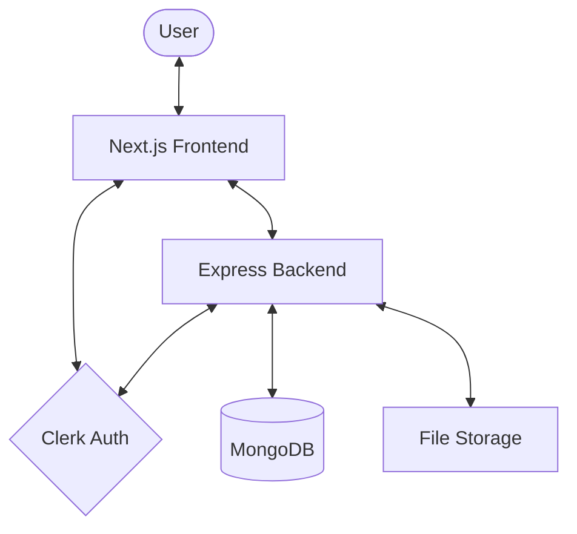

# 🎓 PYQDeck Monorepo

[](https://github.com/pyqdeck/pyqdeck-backend-express/actions/workflows/monorepo-ci.yml)
[](https://codecov.io/gh/pyqdeck/pyqdeck-backend-express)
[](https://github.com/pyqdeck/pyqdeck-backend-express/actions/workflows/codeql-analysis.yml)
[](https://github.com/pyqdeck/pyqdeck-backend-express/actions/workflows/lighthouse.yml)
[](LICENSE)

Welcome to the **PYQDeck** monorepo. This repository contains both the high-performance Express backend and the modern Next.js frontend for the PYQDeck platform—a centralized hub for university question papers and solutions.

---

## 🚀 Mission Control

| Component | Tech Stack | Production URL |
| :--- | :--- | :--- |
| **Backend API** | Node.js, Express, MongoDB, Clerk | [backend.pyqdeck.in](https://backend.pyqdeck.in/) |
| **Frontend Web** | Next.js 15, Tailwind 4, shadcn/ui | [pyqdeck.in](https://pyqdeck.in/) |
| **UI Library** | Storybook 8, Radix UI, Vite | [storybook.pyqdeck.in](https://storybook.pyqdeck.in/) |
| **API Docs** | Swagger / OpenAPI 3.0 | [/api-docs](https://backend.pyqdeck.in/api-docs) |
| **Engineering Docs** | Mintlify | [docs.pyqdeck.in](https://docs.pyqdeck.in/) |
| **Status** | Custom Status Page | [status.pyqdeck.in](https://status.pyqdeck.in/) |

---

## 🏗️ Architectural Overview

PYQDeck is built using a modern, scalable stack designed for high performance and developer productivity.



- **Frontend**: Next.js 15 application providing a seamless, fast user experience.
- **Backend**: Express.js API handling business logic, data persistence, and integrations.
- **Database**: MongoDB (via Mongoose) for flexible, document-based data storage.
- **Authentication**: Clerk for secure, managed user authentication and identity.
- **Storage**: Integration with S3/UploadThing for storing question papers and solutions.

---

## ✨ Feature Highlights

- 🔍 **Advanced Search**: Quickly find question papers by university, subject, or year.
- 📑 **Smart Bookmarking**: Save important papers and solutions to your personal collection.
- 💡 **Verified Solutions**: Access high-quality, peer-reviewed solutions for past questions.
- 📊 **Learning Analytics**: Track your progress and identify areas for improvement.
- 📤 **Community Contributions**: Upload and share papers to help fellow students.

---

## 📂 Project Structure

-   `backend/`: Express API with Mongoose models, controllers, and comprehensive Vitest suites.
-   `frontend/`: Next.js application with a type-safe SDK generated from the backend OpenAPI spec.
-   `docs/`: Mintlify-based internal engineering documentation.

---

## 🎨 Design System & Documentation

We use **Storybook** for UI components and **Mintlify** for full engineering documentation.

### Internal Engineering Docs

Our internal docs site covers API references, architecture, and local development flows.

-   **Live Site**: [docs.pyqdeck.in](https://docs.pyqdeck.in/)
-   **Tech**: Mintlify with OpenAPI synchronization.

### Component Library

We use Storybook to document our UI component library in isolation. This ensures visual consistency and accessibility across the platform.

-   **Live Preview**: [View Component Library](https://storybook.pyqdeck.in/)
-   **Coverage**: 100% of core UI components (50+) documented with interactive stories.
-   **Tech**: Radix UI primitives, Tailwind CSS 4, and Framer Motion.

---

## 💻 Local Development

### Prerequisites
-   Node.js (v20+)
-   pnpm (v10+)
-   MongoDB (Local instance or Atlas)

### 🛠️ Monorepo Workflow

Since this project uses separate `pnpm` environments for backend and frontend without a root-level workspace manager, you should manage them in separate terminal sessions:

1. **Terminal 1 (Backend)**: Run the API server.
2. **Terminal 2 (Frontend)**: Run the Next.js application.

This separation ensures that dependencies and build processes for each component remain isolated and manageable.

### 1. Backend Setup
```bash
cd backend
pnpm install
cp .env.example .env # Configure your Clerk and MongoDB keys
pnpm dev
```

### 2. Frontend Setup
```bash
cd frontend
pnpm install
# Ensure you have .env.local configured (see Environment Variables section)
pnpm run gen:api # Generates the type-safe API SDK from backend
pnpm dev
```

---

## 🔑 Environment Variables

### Backend (`backend/.env`)

| Variable | Description | Default |
| :--- | :--- | :--- |
| `PORT` | The port the backend server runs on. | `3000` |
| `MONGODB_URI` | Connection string for your MongoDB instance. | `mongodb://localhost:27017/pyqdeck` |
| `CLERK_PUBLISHABLE_KEY` | Clerk public key for client-side auth. | - |
| `CLERK_SECRET_KEY` | Clerk secret key for server-side auth. | - |
| `CLERK_WEBHOOK_SECRET` | Secret used to verify incoming Clerk webhooks. | - |
| `RESEND_API_KEY` | API key for Resend email service. | - |

### Frontend (`frontend/.env.local`)

| Variable | Description | Default |
| :--- | :--- | :--- |
| `NEXT_PUBLIC_API_URL` | The base URL of the backend API. | `http://localhost:3000/api/v1` |
| `NEXT_PUBLIC_CLERK_PUBLISHABLE_KEY` | Clerk public key (must match backend). | - |
| `CLERK_SECRET_KEY` | Clerk secret key (must match backend). | - |

---

## 🛡️ CI/CD & API Safety

We use a **Unified Monorepo Pipeline** that guarantees stability across the stack:

1.  **API Contract Safety**: Every PR verifies that `backend/openapi.json` is in sync with the code. If you modify an API route or model, you must run `pnpm run openapi:export` in the backend.
2.  **SDK Validation**: The frontend SDK is regenerated in CI. If a backend change breaks the frontend types, the build will fail immediately.
3.  **Docker Health Check**: Automated builds of the backend Docker image to ensure deployment readiness.
4.  **Sequential Deploys**: Deployment to Render and Vercel triggers only after all quality checks (Lint, Test, Build) pass for both projects.

---

## 🧪 Quality & Testing

### Backend
```bash
cd backend
pnpm test          # Run Vitest suites
pnpm test:coverage # Generate coverage (Target: 80%+)
```

### Frontend
```bash
cd frontend
pnpm lint   # Run ESLint
pnpm build  # Verify Next.js build & type-safety
```

---

## 🛠️ Troubleshooting

- **MongoDB Connection Issues**: Ensure your MongoDB service is running or that your `MONGODB_URI` is correct. If using Atlas, ensure your IP is whitelisted.
- **Clerk Integration**: Double-check that your keys are correctly copied into both `.env` and `.env.local`. Ensure your Clerk instance is properly configured for webhooks if you're using them.
- **SDK Regeneration**: If the frontend types are out of sync with the backend, run `pnpm run gen:api` in the `frontend` directory. Ensure the backend is configured correctly as this script exports the OpenAPI spec first.

---

## 🤝 Contribution

We welcome contributions! Please see our [CONTRIBUTING.md](CONTRIBUTING.md) for guidelines on branch naming, the pull request process, and coding standards.

---

© 2026 PYQDeck Team. Built with ❤️ for students.

## 📜 License

This project is proprietary and confidential. All rights reserved. No part of this software may be used, modified, or distributed without the express written permission of the copyright holder.
