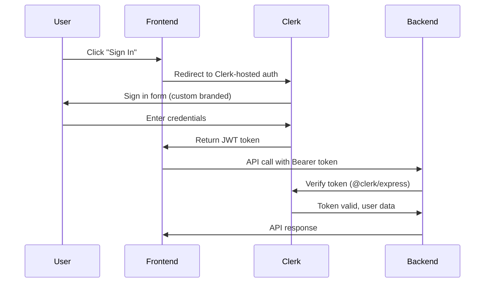

## Overview

PyqDeck uses **Clerk** for authentication, with custom branding on the frontend and Svix webhooks for user synchronization on the backend.



## Frontend Auth

### Clerk Provider

The app is wrapped with `ClerkProvider` in the root layout:

```javascript
// frontend/src/app/layout.jsx
import { ClerkProvider } from '@clerk/nextjs';

export default function RootLayout({ children }) {
  return (
    <ClerkProvider
      publishableKey={process.env.NEXT_PUBLIC_CLERK_PUBLISHABLE_KEY}
      appearance={{
        // Custom branding
        variables: { colorPrimary: '#3B82F6' },
      }}
    >
      {children}
    </ClerkProvider>
  );
}
```

### Auth Pages

Custom sign-in and sign-up pages using Clerk's components:

```javascript
// frontend/src/app/sign-in/[[...sign-in]]/page.jsx
import { SignIn } from '@clerk/nextjs';

export default function SignInPage() {
  return <SignIn path="/sign-in" />;
}
```

### Getting the Token for API Calls

The `useApi()` hook handles token injection automatically:

```javascript
// frontend/src/hooks/use-api.js
import { useAuth } from '@clerk/nextjs';
import { Api } from '@/lib/api-generated';

export function useApi() {
  const { getToken } = useAuth();

  return new Api({
    securityWorker: async () => {
      const token = await getToken();
      return token ? { Authorization: `Bearer ${token}` } : {};
    },
    baseURL: process.env.NEXT_PUBLIC_API_URL,
  });
}
```

## Backend Auth

### Middleware Verification

The backend uses `@clerk/express` to verify JWT tokens on protected routes:

```javascript
import { requireAuth } from '@clerk/express';

// Protect a route
router.get('/users/me', requireAuth(), userController.getMe);

// Auth object is available on req.auth
router.get('/bookmarks', requireAuth(), bookmarkController.getBookmarks);
```

### Getting User ID

After `requireAuth()`, the user ID is available on the request:

```javascript
function getBookmarks(req, res) {
  const userId = req.auth.userId;
  // Query bookmarks for this user
}
```

## Webhook Synchronization

Clerk sends webhooks for user events (creation, updates, deletion). The backend processes these via Svix:

### Webhook Endpoint

```javascript
// backend/src/routes/webhook.routes.js
import { Webhook } from 'svix';

router.post('/webhooks/clerk', express.raw({ type: 'application/json' }), async (req, res) => {
  const wh = new Webhook(process.env.CLERK_WEBHOOK_SECRET);
  const event = wh.verify(req.body, req.headers);

  switch (event.type) {
    case 'user.created':
      // Create user in MongoDB
      await createUserInDB(event.data);
      break;
    case 'user.updated':
      // Update user in MongoDB
      await updateUserInDB(event.data);
      break;
    case 'user.deleted':
      // Delete user from MongoDB
      await deleteUserFromDB(event.data);
      break;
  }

  res.json({ received: true });
});
```

### Local Development

For local webhook testing, use the [Clerk CLI](https://clerk.com/docs/webhooks/sync-data):

```bash
clerk listen
```

This forwards Clerk webhooks to your local backend.

## Auth Flow Details

### Custom Branding

Clerk's UI is customized to match PyqDeck's brand:

- **Colors**: Primary blue (`#3B82F6`)
- **Fonts**: Matching the app's typography
- **Logo**: PyqDeck logo on auth pages

### OTP Verification

For phone/email verification, Clerk handles the OTP flow:

1. User enters phone/email
2. Clerk sends OTP code
3. User enters code on verification page
4. Clerk verifies and returns JWT

### Session Management

- **JWT tokens** are automatically managed by Clerk
- **Token refresh** happens automatically via `getToken()`
- **Session expiry** is configured in Clerk dashboard

## Environment Variables

| Variable | Frontend | Backend |
|---|---|---|
| `CLERK_PUBLISHABLE_KEY` | `NEXT_PUBLIC_CLERK_PUBLISHABLE_KEY` | `CLERK_PUBLISHABLE_KEY` |
| `CLERK_SECRET_KEY` | - | `CLERK_SECRET_KEY` |
| `CLERK_WEBHOOK_SECRET` | - | `CLERK_WEBHOOK_SECRET` |

## Security Considerations

1. **Never expose `CLERK_SECRET_KEY`** - Only used server-side
2. **Verify webhooks with Svix** - Prevents forged webhook events
3. **Protect API routes with `requireAuth()`** - Ensures only authenticated users can access protected endpoints
4. **Rate limiting** - Auth-related endpoints are rate-limited

## Next Steps

- Explore the [monorepo architecture](/architecture/monorepo)
- Learn about [the SDK flow](/development/sdk-flow)
- Review [testing standards](/development/testing)
