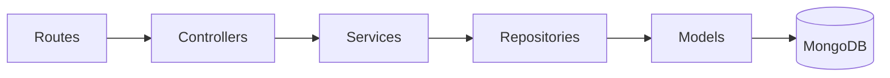

## Overview

The PyqDeck backend uses a strict **5-layer architecture**. Every request flows through these layers in order, and each layer has a single, well-defined responsibility.



| Layer | Directory | Responsibility |
|---|---|---|
| **Routes** | `src/routes/` | URL patterns, middleware chains, OpenAPI annotations |
| **Controllers** | `src/controllers/` | Request/response handling, input extraction |
| **Services** | `src/services/` | Business logic, multi-repository orchestration |
| **Repositories** | `src/repositories/` | Database queries, aggregations, data access |
| **Models** | `src/models/` | Schema definitions, Zod validation schemas |

**Golden rule**: Each layer can only call the layer directly below it. Controllers never call repositories directly; services never touch Mongoose models.

## Boot Sequence

### Entry Point (`src/index.js`)

1. Initialize Sentry (if `SENTRY_DSN` is set)
2. Connect to MongoDB
3. Start Express server on configured port
4. Register graceful shutdown (`SIGTERM`/`SIGINT`) — close HTTP server, then disconnect MongoDB, with a 10-second forced exit timeout

### App Bootstrap (`src/app.js`)

Middleware is mounted in a specific order:

```js
// 1. Sentry error handler (if DSN present)
// 2. Security
app.use(helmet());
app.use(cors());
// 3. HTTP request logging
app.use(morgan('dev'));
// 4. Webhook routes BEFORE express.json() (needs raw body for Svix)
app.use('/api/v1/webhooks', webhookRoutes);
// 5. Body parsing
app.use(express.json());
app.use(express.urlencoded({ extended: true }));
// 6. Swagger API docs
// 7. Clerk auth + user sync (global)
app.use(clerkMiddleware());
app.use(syncUser);
// 8. All resource routes under /api/v1
// 9. Global error handler (must be last)
app.use(errorHandler);
```

### Route Mounting

All resource routes are mounted under `/api/v1`:

```js
app.use('/api/v1', healthRoutes);
app.use('/api/v1/universities', universityRoutes);
app.use('/api/v1/universities/:universityId/branches', branchRoutes);
app.use('/api/v1/branches/:branchId/semesters', semesterRoutes);
app.use('/api/v1/subjects', subjectRoutes);
app.use('/api/v1/subject-offerings', subjectOfferingRoutes);
app.use('/api/v1/questions', questionRoutes);
app.use('/api/v1/solutions', solutionRoutes);
app.use('/api/v1/papers', paperRoutes);
app.use('/api/v1/papers/:paperId/questions', paperQuestionRoutes);
app.use('/api/v1/bookmarks', bookmarkRoutes);
app.use('/api/v1/users', userRoutes);
app.use('/api/v1/search', searchRoutes);
app.use('/api/v1', syllabusRoutes);
app.use('/api/v1/seo', seoRoutes);
```

## Layer 1: Routes

Route files create an Express `Router`, define endpoints with OpenAPI JSDoc annotations, apply middleware chains, and export the router as default.

### Pattern A: Standard CRUD

```js
// routes/papers.js
const router = Router();

// PUBLIC - paginated list
router.get('/', paginate(), paperController.list);

// PUBLIC - fetch by slug
router.get('/:slug', paperController.getBySlug);

// AUTH + EDITOR role + Zod validation
router.post(
  '/',
  requireAuthentication,
  isEditor,
  validateBody(paperZodSchema),
  paperController.create
);

// AUTH + ADMIN only
router.patch(
  '/:id/status',
  requireAuthentication,
  isAdmin,
  validateBody(statusSchema),
  paperController.updateStatus
);

router.delete('/:id', requireAuthentication, isAdmin, paperController.remove);
```

### Pattern B: Router-wide Auth

```js
// routes/bookmarks.js
const router = Router();

// All routes in this file require auth (applied once)
router.use(requireAuthentication);

router.get('/', paginate(), bookmarkController.listMine);

router.post(
  '/toggle',
  validateBody(bookmarkZodSchema.omit({ userId: true })),
  bookmarkController.toggle
);

router.delete('/:id', bookmarkController.remove);
```

### Pattern C: Nested/Param Routes

```js
// routes/paperQuestions.js
const router = Router({ mergeParams: true }); // Access :paperId from parent

router.get('/', paginate(), questionController.listByPaper);

router.post(
  '/',
  requireAuthentication,
  isEditor,
  validateBody(questionZodSchema),
  questionController.createForPaper
);

// Nested solutions under paper/questions
router.post(
  '/:questionId/solutions',
  requireAuthentication,
  validateBody(solutionZodSchema.omit({ questionId: true, authorId: true })),
  solutionController.create
);
```

### Route Middleware

| Middleware | Purpose |
|---|---|
| `paginate()` | Parses `page`/`limit` query params, attaches `req.pagination` |
| `validateBody(schema)` | Zod validates `req.body`, replaces it with sanitized data |
| `requireAuthentication` | Checks Clerk `userId`, throws 401 if missing |
| `isEditor` | Allows editor OR admin role |
| `isAdmin` | Admin-only access |

### OpenAPI Annotations

Every route has `@openapi` JSDoc blocks for Swagger generation:

```js
/**
 * @openapi
 * /papers:
 *   get:
 *     summary: List all papers
 *     tags: [Papers]
 *     parameters:
 *       - in: query
 *         name: examYear
 *         schema: { type: number }
 *     responses:
 *       200:
 *         description: Paginated list of papers
 */
router.get('/', paginate(), paperController.list);
```

## Layer 2: Controllers

Controllers are **thin** — they extract request data, call services, format responses. No business logic lives here.

### Standard Pattern

```js
// controllers/paperController.js
import paperService from '../services/paperService.js';
import { successFormatter } from '../utils/index.js';

export async function list(req, res, next) {
  try {
    const filter = {};
    const isAdmin = req.dbUser?.role === 'admin';
    if (!isAdmin) filter.status = 'approved';  // Public sees only approved

    if (req.query.examYear) filter.examYear = Number(req.query.examYear);
    if (req.query.examType) filter.examType = req.query.examType;

    const { items, total, page, limit } = await paperService.list(filter, req.pagination);
    res.json(successFormatter.formatList(items, total, page, limit, 'Papers fetched'));
  } catch (error) {
    next(error);  // Forward to errorHandler
  }
}

export async function create(req, res, next) {
  try {
    const paper = await paperService.create(req.body, req.dbUser?._id);
    res.status(201).json(successFormatter.formatSuccess(paper, 'Paper created'));
  } catch (error) {
    next(error);
  }
}

export async function remove(req, res, next) {
  try {
    await paperService.delete(req.params.id);
    res.status(204).send();  // No content
  } catch (error) {
    next(error);
  }
}
```

### Controller Conventions

| Convention | Detail |
|---|---|
| Request data | Extract from `req.params`, `req.query`, `req.body` |
| User context | `req.dbUser` (attached by `syncUser` middleware) |
| Pagination | `req.pagination` (attached by `paginate()` middleware) |
| Success response | `successFormatter.formatSuccess(data, message)` for single items |
| List response | `successFormatter.formatList(items, total, page, limit, message)` |
| Delete response | `res.status(204).send()` — no body |
| Error handling | `next(error)` — forwards to global `errorHandler` |

### Early Return Pattern

```js
// controllers/searchController.js
export async function unifiedSearch(req, res, next) {
  try {
    const { q } = req.query;
    if (!q) {
      return res.json(successFormatter.formatSuccess({}, 'No query provided'));
    }
    const results = await searchService.unifiedSearch(q, req.pagination);
    res.json(successFormatter.formatSuccess(results, 'Search results fetched'));
  } catch (error) {
    next(error);
  }
}
```

## Layer 3: Services

Services are instantiated as singleton classes. They orchestrate business logic and coordinate between repositories.

### Pattern A: Thin Delegator (Most Services)

```js
// services/paperService.js
class PaperService {
  async list(filter = {}, pagination) {
    return paperRepository.findAll(filter, pagination);
  }

  async create(data, uploadedBy) {
    // Enriches data before passing down
    return paperRepository.create({ ...data, uploadedBy });
  }

  async updateStatus(id, status) {
    logger.info('Paper status updated', { id, status });
    return paperRepository.updateStatus(id, status);
  }
}
```

Most services are thin — they add value through:
- **Data enrichment**: injecting `uploadedBy`, timestamps, etc.
- **Logging**: recording important actions
- **Validation**: pre-flight checks before hitting the database

### Pattern B: Multi-Repository Orchestration

```js
// services/questionService.js
class QuestionService {
  async createForPaper(paperId, data, createdBy) {
    // 1. Create the question
    const question = await questionRepository.create({ ...data, createdBy });
    // 2. Create the paper-question mapping
    const mapping = await questionPaperMapRepository.create({
      paperId,
      questionId: question._id || question.id,
      questionNumber: data.questionNumber,
      order: data.order,
      marks: data.marks,
      section: data.section,
    });
    return { question, mapping };
  }

  async linkToPaper(paperId, questionId, meta = {}) {
    return questionPaperMapRepository.create({ paperId, questionId, ...meta });
  }
}
```

### Pattern C: Business Logic (Toggle Pattern)

```js
// services/bookmarkService.js
class BookmarkService {
  async toggle(userId, targetData) {
    const { targetId, targetType, note } = targetData;

    try {
      // If bookmark exists, delete it (unbookmark)
      await bookmarkRepository.findByUserAndTarget(userId, targetId, targetType);
      await bookmarkRepository.deleteByUserAndTarget(userId, targetId, targetType);
      return { bookmarked: false };
    } catch (error) {
      if (!(error instanceof NotFoundError)) throw error;
      // If not found, create it (bookmark)
      const bookmark = await bookmarkRepository.create({
        userId, targetId, targetType, note,
      });
      return { bookmarked: true, bookmark };
    }
  }

  async remove(id, userId) {
    const bookmark = await bookmarkRepository.findById(id);
    // Ownership check
    if (bookmark.userId.toString() !== userId.toString()) {
      throw new NotFoundError('Bookmark not found');  // Intentionally vague for security
    }
    return bookmarkRepository.delete(id);
  }
}
```

### Pattern D: Parallel Queries

```js
// services/searchService.js
class SearchService {
  async unifiedSearch(query, pagination) {
    const searchRegex = new RegExp(query, 'i');

    const [questions, subjects, papers] = await Promise.all([
      questionRepository.findWithContext({ text: searchRegex }, pagination),
      subjectRepository.findAll({ $or: [{ name: searchRegex }, { subjectCode: searchRegex }] }, pagination),
      paperRepository.findAll({ $or: [{ title: searchRegex }, { exam: searchRegex }] }, pagination),
    ]);

    return {
      questions: questions.items,
      subjects: subjects.items,
      papers: papers.items,
      totalQuestions: questions.total,
      totalSubjects: subjects.total,
      totalPapers: papers.total,
    };
  }
}
```

## Layer 4: Repositories

Repositories are the **only** layer that directly imports Mongoose models. They handle all database operations.

### Standard CRUD

```js
// repositories/paperRepository.js
import { Paper } from '../models/Paper.js';
import { NotFoundError, ConflictError } from '../utils/errors/index.js';
import { paginate } from '../utils/pagination/index.js';

class PaperRepository {
  async create(data) {
    try {
      const paper = new Paper(data);
      await paper.save();
      return paper;
    } catch (error) {
      if (error.code === 11000) {
        throw new ConflictError('Paper with this slug already exists');
      }
      throw error;
    }
  }

  async findById(id) {
    const paper = await Paper.findById(id);
    if (!paper) throw new NotFoundError('Paper not found');
    return paper;
  }

  async findBySlug(slug) {
    const paper = await Paper.findOne({ slug });
    if (!paper) throw new NotFoundError('Paper not found');
    return paper;
  }

  async findAll(filter = {}, pagination) {
    return paginate(Paper, filter, pagination, { sort: { examYear: -1 } });
  }

  async update(id, data) {
    const paper = await Paper.findByIdAndUpdate(id, data, { returnDocument: 'after' });
    if (!paper) throw new NotFoundError('Paper not found');
    return paper;
  }

  async delete(id) {
    const paper = await Paper.findByIdAndDelete(id);
    if (!paper) throw new NotFoundError('Paper not found');
    return paper;
  }
}
```

### Repository Conventions

| Convention | Detail |
|---|---|
| Not found | Always throw `NotFoundError` |
| Duplicate key | Catch `error.code === 11000`, throw `ConflictError` |
| Update | Use `{ returnDocument: 'after' }` to return updated doc |
| Pagination | Use shared `paginate()` utility |

### The Pagination Utility

```js
// utils/pagination/index.js
export async function paginate(model, filter = {}, { page, limit, skip }, options = {}) {
  const [items, total] = await Promise.all([
    model.find(filter, null, options).skip(skip).limit(limit),
    model.countDocuments(filter),
  ]);
  return { items, total, page, limit };
}
```

### Aggregation Pipeline

For complex joins, repositories use MongoDB aggregation:

```js
// repositories/questionRepository.js
async findWithContext(filter = {}, pagination = {}) {
  const pipeline = [
    { $match: matchFilter },
    { $sort: { createdAt: -1 } },
    // Join Paper via QuestionPaperMap
    {
      $lookup: {
        from: 'questionpapermaps',
        localField: '_id',
        foreignField: 'questionId',
        as: 'paperMappings',
      },
    },
    {
      $lookup: {
        from: 'paper',
        localField: 'paperMappings.paperId',
        foreignField: '_id',
        as: 'paperContext',
      },
    },
    // Join Topic via QuestionSyllabusMap
    {
      $lookup: {
        from: 'questionsyllabusmaps',
        localField: '_id',
        foreignField: 'questionId',
        as: 'syllabusMappings',
      },
    },
    {
      $lookup: {
        from: 'topics',
        localField: 'syllabusMappings.topicId',
        foreignField: '_id',
        as: 'topics',
      },
    },
    {
      $project: {
        text: 1, type: 1, difficulty: 1, marks: 1,
        paperContext: { $map: { input: '$paperContext', as: 'p', in: { title: '$$p.title', year: '$$p.examYear' } } },
        topicContext: { $map: { input: '$topics', as: 't', in: { name: '$$t.title' } } },
      },
    },
  ];

  const [items, total] = await Promise.all([
    Question.aggregate(pipeline),
    Question.countDocuments(filter),
  ]);

  return { items, total, page, limit };
}
```

## Layer 5: Models

Each model file exports:
1. A Mongoose schema and model
2. A Zod validation schema (for route-level request validation)
3. Enum constants as Zod enums

### Universal Patterns

All models share:
- `timestamps: true` — auto `createdAt`/`updatedAt`
- `versionKey: false` — no `__v` field
- `toJSON`/`toObject` transforms — convert `_id` to `id` (string)
- Compound indexes defined on the schema

### Paper Model

```js
// models/Paper.js
const paperSchema = new mongoose.Schema({
  subjectOfferingId: { type: mongoose.Schema.Types.ObjectId, ref: 'SubjectOffering', required: true },
  title: { type: String, required: true, trim: true },
  examYear: { type: Number, required: true },
  examType: { type: String, enum: ['regular', 're-exam', 'supplementary', 'end-sem', 'internal'], required: true },
  session: { type: String, trim: true },
  slug: { type: String, required: true, unique: true, immutable: true, lowercase: true, trim: true },
  uploadedBy: { type: mongoose.Schema.Types.ObjectId, ref: 'User' },
  status: { type: String, enum: ['draft', 'pending', 'approved', 'rejected'], default: 'pending' },
}, { timestamps: true, versionKey: false });

paperSchema.index({ subjectOfferingId: 1, examYear: -1 });
paperSchema.index({ examYear: -1 });
paperSchema.index({ status: 1 });
```

**Notable**: `slug` is `immutable: true` — cannot change after creation. `status` defaults to `pending` — requires admin approval.

### Question Model

```js
// models/Question.js
const questionSchema = new mongoose.Schema({
  text: { type: String, required: true, trim: true },
  normalizedText: { type: String, trim: true },
  type: { type: String, enum: ['mcq', 'short', 'long', 'numerical', 'coding'], required: true },
  difficulty: { type: String, enum: ['easy', 'medium', 'hard'] },
  bloomLevel: { type: String, enum: ['remember', 'understand', 'apply', 'analyze', 'evaluate', 'create'] },
  marks: { type: Number, min: 0 },
  tags: [{ type: mongoose.Schema.Types.ObjectId, ref: 'Tag' }],
  images: { type: [String], default: [] },
  equations: { type: [String], default: [] },
  codeSnippets: { type: [String], default: [] },
  slug: { type: String, unique: true, sparse: true },
  createdBy: { type: mongoose.Schema.Types.ObjectId, ref: 'User' },
  isVerified: { type: Boolean, default: false },
}, { timestamps: true, versionKey: false });

questionSchema.index({ text: 'text', normalizedText: 'text' });  // Full-text search
questionSchema.index({ type: 1, difficulty: 1 });
```

### Key Models at a Glance

| Model | Key Feature |
|---|---|
| `User` | Linked to Clerk via `clerkId`, roles: normal/editor/admin |
| `Paper` | Approval workflow via `status` field, immutable slug |
| `Question` | Full-text search index, polymorphic via `QuestionPaperMap` |
| `QuestionPaperMap` | Join table with unique `(paperId, questionId)` index |
| `Bookmark` | Polymorphic via `refPath: 'targetType'` (question/paper/solution) |
| `Subject` | SEO redirects via `redirectSlugs` array |
| `Solution` | Approval workflow, types: teacher/student/ai |

## Complete Request Flow: `GET /api/v1/papers?examYear=2023`

```
1. Middleware Stack
   helmet() → cors() → morgan() → express.json() → clerkMiddleware() → syncUser()

2. Routes Layer
   GET /api/v1/papers matches paperRoutes
   paginate() middleware runs → req.pagination = { page: 1, limit: 20, skip: 0 }

3. Controllers Layer
   paperController.list() extracts filter from query params
   Public user → filter.status = 'approved'
   Calls paperService.list(filter, req.pagination)

4. Services Layer
   paperService.list() delegates to paperRepository.findAll(filter, pagination)

5. Repositories Layer
   paperRepository.findAll() calls paginate(Paper, filter, pagination, { sort: { examYear: -1 } })

6. Models Layer
   Paper.find({ status: 'approved', examYear: 2023 })
        .sort({ examYear: -1 })
        .skip(0).limit(20)

7. Response
   successFormatter.formatList(items, total, page, limit, 'Papers fetched')
   → { status: 'success', message: 'Papers fetched', data: { items: [...], pagination: {...} } }
```

### Error Path

If any layer throws:
1. Controller catches → `next(error)`
2. `errorHandler` middleware receives it
3. 500+ errors → captured by Sentry
4. `errorFormatter` distinguishes operational errors from internal errors
5. In production, stack traces are stripped from 500 responses

## Cross-Cutting Concerns

| Concern | How |
|---|---|
| Auth | Clerk → `clerkMiddleware()` → `req.auth` |
| User sync | `syncUser` → lazy-create User in MongoDB from Clerk |
| Authorization | `requireAuthentication`, `isAdmin`, `isEditor` middleware |
| Validation | Zod schemas in Model files → `validateBody()` middleware |
| Pagination | `paginate()` middleware + shared utility |
| Errors | Custom `BaseError` hierarchy → centralized `errorHandler` |
| Responses | `successFormatter.formatSuccess()` / `formatList()` |
| Logging | Winston-based `loggerService` |
| Monitoring | Sentry for 500s, Morgan for HTTP requests |
| API docs | OpenAPI 3 JSDoc on routes → Swagger UI at `/api-docs` |

## Adding a New Feature

When adding a new endpoint (e.g., `POST /api/v1/feedback`):

1. **Model** — Define `Feedback.js` with Mongoose schema + Zod schema
2. **Repository** — Create `feedbackRepository.js` with CRUD methods
3. **Service** — Create `feedbackService.js` with business logic
4. **Controller** — Create `feedbackController.js` with request handlers
5. **Route** — Create `feedback.routes.js` with URL patterns + middleware + OpenAPI annotations
6. **Mount** — Add to `app.js`: `app.use('/api/v1/feedback', feedbackRoutes)`

## Next Steps

- Explore the [monorepo architecture](/architecture/monorepo)
- Learn about the [data pipeline](/architecture/data-pipeline)
- Review [testing standards](/development/testing)
