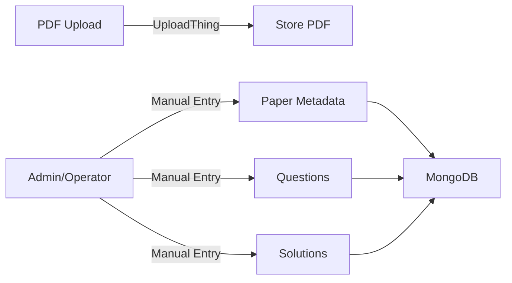

## Overview

PyqDeck's core value is its collection of university question papers. This page explains how papers flow into the system and how questions and solutions are managed.

## Current Architecture: Manual Data Entry

**The system currently uses manual data entry** rather than automated PDF parsing. Papers, questions, and solutions are created through REST API endpoints — either via the admin CLI or direct API calls.



## Upload Pipeline

### 1. PDF File Upload

Users upload question paper PDFs through **UploadThing**, a managed file upload service.

**Configuration** (`backend/src/utils/uploadthing.js`):

| Setting | Value |
|---|---|
| Max file size | 16MB |
| File type | `.pdf` only |
| Concurrency | 1 file at a time |

**Upload Flow**:

1. User uploads a PDF via the frontend
2. UploadThing stores the file and returns a URL
3. Backend `onUploadComplete` callback creates an `Upload` record in MongoDB:

```javascript
{
  url: "https://utfs.io/f/...",
  publicId: "abc123",
  mimeType: "application/pdf",
  size: 2048576,
  uploadedBy: "user_clerk_id"
}
```

The PDF is stored as-is — **no parsing occurs at upload time**.

### 2. Paper Creation

Paper metadata is created via `POST /api/v1/papers`:

```javascript
{
  "title": "Mathematics III",
  "year": 2024,
  "examType": "semester",
  "slug": "mathematics-iii-2024",
  "universityId": "univ_123",
  "subjectId": "subj_456",
  "semesterId": "sem_789"
}
```

### 3. Question Entry

Questions are added to a paper via `POST /api/v1/papers/:paperId/questions`:

```javascript
{
  "text": "Solve the differential equation...",
  "type": "long",           // mcq | short | long | numerical | coding
  "difficulty": "medium",   // easy | medium | hard
  "bloomLevel": "apply",    // remember | understand | apply | analyze | evaluate | create
  "marks": 10,
  "images": [],             // Optional diagram URLs
  "equations": [],          // Optional LaTeX equations
  "codeSnippets": []        // Optional code blocks
}
```

Each question is linked to its paper via the `QuestionPaperMap` model.

### 4. Solutions

Solutions are stored separately and linked to questions:

```javascript
{
  "content": "Step-by-step text explanation...",
  "latexContent": "\\frac{d}{dx} = ...",
  "images": [],
  "videoLinks": [],
  "type": "teacher",        // teacher | student | ai
  "status": "approved"      // draft | pending | approved | rejected
}
```

The `type` field includes an `ai` enum value, indicating **AI-generated solutions are planned** but not yet implemented.

## Academic Hierarchy

The data model follows a strict academic hierarchy:

```
University
  └── Branch (e.g., Computer Science)
        └── Semester (e.g., Semester 3)
              └── Subject (e.g., Data Structures)
                    └── SubjectOffering (active enrollment)
                          └── Papers
                                └── Questions
                                      └── Solutions
```

### Key Models

| Model | Purpose |
|---|---|
| `University` | University/institution |
| `Branch` | Department/stream within a university |
| `Semester` | Academic semester |
| `Subject` | Course/subject catalog |
| `SubjectOffering` | Active subject enrollment for a semester |
| `Paper` | Exam paper metadata |
| `Question` | Individual question content |
| `QuestionPaperMap` | Links questions to papers |
| `Solution` | Answer/explanation for a question |
| `Syllabus` | Curriculum structure |
| `Module` | Syllabus module |
| `Topic` | Topic within a module |
| `QuestionSyllabusMap` | Links questions to syllabus topics |
| `Bookmark` | User-saved questions |
| `Tag` | Question tags/categorization |
| `Upload` | Uploaded file metadata |
| `User` | User profiles (synced from Clerk) |

## Admin CLI

The project includes an interactive admin CLI for managing data:

```bash
cd backend
pnpm admin
```

Features:
- **View users** and stats
- **Seed data** for development
- **Wipe database** (danger zone)
- **View unsolved questions** report (questions without solutions)

## Future: AI-Powered Parsing

The architecture is designed to support automated PDF parsing in the future:

1. **PDF Parser**: Extract text and structure from uploaded PDFs using a PDF parsing library
2. **AI Question Extraction**: Use an LLM (Gemini, OpenAI, etc.) to identify individual questions, types, and metadata
3. **AI Solution Generation**: The `Solution.type: 'ai'` enum is already reserved for AI-generated answers
4. **Human Review Workflow**: Solutions go through `draft → pending → approved` before going live

When this is implemented, the flow will be:

```
PDF Upload → UploadThing → PDF Parser → AI Extraction → Questions + Solutions → Human Review → Published
```

## API Endpoints

| Method | Path | Description |
|---|---|---|
| `POST` | `/uploadthing` | Upload a PDF file |
| `POST` | `/papers` | Create a paper |
| `GET` | `/papers` | List papers |
| `POST` | `/papers/:id/questions` | Add questions to a paper |
| `GET` | `/papers/:id/questions` | Get questions for a paper |
| `POST` | `/solutions` | Create a solution |
| `GET` | `/solutions` | List solutions |
| `GET` | `/search` | Search across papers and questions |

## Next Steps

- Explore the [auth flow](/architecture/auth-flow)
- Review [testing standards](/development/testing)
- Check the [deployment pipeline](/infrastructure/deployment)
