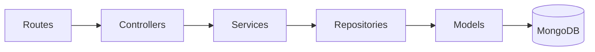

## Overview

The PyqDeck backend is built with **Express 5** and **Node.js 20+**, utilizing a strict **5-layer architecture**. Every request flows through these layers in order, ensuring a clean separation of concerns.

## The 5 Layers

| Layer            | Directory                   | Responsibility                                                        |
| ---------------- | --------------------------- | --------------------------------------------------------------------- |
| **Routes**       | `backend/src/routes/`       | URL patterns, middleware chains, and OpenAPI JSDoc annotations.       |
| **Controllers**  | `backend/src/controllers/`  | Request/response handling, input extraction, and response formatting. |
| **Services**     | `backend/src/services/`     | Business logic and orchestration between multiple repositories.       |
| **Repositories** | `backend/src/repositories/` | Database queries, aggregations, and direct Mongoose interaction.      |
| **Models**       | `backend/src/models/`       | Schema definitions, Zod validation schemas, and database indexes.     |

**Golden Rule**: Each layer can only call the layer directly below it.

## Request Lifecycle

1. **Middleware Stack**: Authenticates (Clerk), parses bodies, and handles security (Helmet, CORS).
2. **Routes**: Matches the URL and applies route-specific validation/pagination middleware.
3. **Controller**: Extracts data from `req.body`, `req.params`, or `req.query`.
4. **Service**: Processes business logic (e.g., checking permissions, calculating fields).
5. **Repository**: Executes the MongoDB query via Mongoose.
6. **Response**: The controller formats the data using `successFormatter` and sends it to the client.

## Key Implementation Details

### Authentication & Authorization

- **Middleware**: `backend/src/middlewares/auth.middleware.js`
- **User Sync**: `backend/src/middlewares/syncUser.middleware.js` (lazily provisions users from Clerk).

### Error Handling

- **Centralized Error Handler**: `backend/src/middlewares/errorHandler.js`
- **Custom Errors**: `backend/src/utils/errors/index.js` (e.g., `NotFoundError`, `ConflictError`).

### Data Fetching & Pagination

- **Shared Utility**: `backend/src/utils/pagination/index.js`
- **Middleware**: `backend/src/middlewares/pagination.middleware.js` (attaches `req.pagination`).

## Database Management

- **ODM**: Mongoose
- **Indexes**: Defined in the `models/` files for optimal query performance.
- **Validations**: Zod schemas in models ensure data integrity before it even hits Mongoose.

## Adding New Features

To add a new resource, follow the 5-layer pattern:

1. Create a **Model** (schema + Zod).
2. Create a **Repository** for data access.
3. Create a **Service** for business logic.
4. Create a **Controller** for request handling.
5. Create a **Route** and mount it in `backend/src/app.js`.

## Next Steps

- Explore the [monorepo architecture](/system-overview/architecture)
- Learn about the [data pipeline](/workflows/data-pipeline)
- Review [testing standards](/system-overview/testing)
