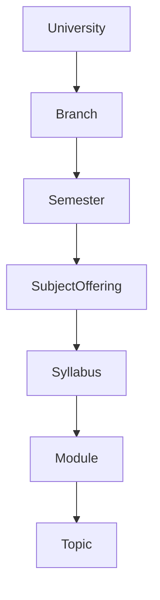

## Overview

PyqDeck uses **MongoDB** as its primary database, with **Mongoose** as the ODM (Object Data Modeling) library. The schema is designed to support a hierarchical academic structure and a rich set of features like bookmarks, solutions, and AI-powered metadata.

## Academic Hierarchy

The core of the system is the academic hierarchy, which follows this path:



- **University**: The top-level entity (e.g., University of Mumbai).
- **Branch**: Academic departments within a university (e.g., Computer Engineering).
- **Semester**: A specific term within a branch (e.g., Semester 5).
- **SubjectOffering**: A specific instance of a subject for a particular university/branch/semester combination, linked to a specific regulation.
- **Syllabus**: The container for the curriculum of a SubjectOffering.
- **Module**: High-level divisions of a syllabus.
- **Topic**: Specific concepts within a module.

## Core Models

### User

- **Purpose**: Stores user profiles and authentication metadata.
- **Key Fields**: `clerkId`, `name`, `email`, `role` (normal/editor/admin).
- **Integration**: Synced from Clerk via `syncUser` middleware.

### University

- **Purpose**: Represents a university.
- **Key Fields**: `name`, `shortName`, `slug`, `state`, `country`.

### Branch

- **Purpose**: Represents a course or department.
- **Key Fields**: `universityId`, `name`, `slug`.

### Semester

- **Purpose**: Represents an academic term.
- **Key Fields**: `branchId`, `number`, `slug`.

### Subject

- **Purpose**: Canonical definition of an academic subject.
- **Key Fields**: `name`, `code`.

### SubjectOffering

- **Purpose**: Links a Subject to a University, Branch, and Semester.
- **Key Fields**: `universityId`, `branchId`, `semesterId`, `subjectId`, `regulation`, `academicYear`.

### Syllabus, Module, Topic

- **Purpose**: Define the granular structure of the curriculum.
- **Relationships**: `Topic` -> `Module` -> `Syllabus` -> `SubjectOffering`.

### Paper

- **Purpose**: Represents an exam paper.
- **Key Fields**: `universityId`, `subjectOfferingId`, `year`, `month`, `examType` (Regular/KT).
- **Status**: `draft`, `published`, `archived`.

### Question

- **Purpose**: Individual questions from papers.
- **Key Fields**: `content`, `type` (Theory/Numerical/MCQ), `difficulty`, `bloomLevel`.

### Solution

- **Purpose**: User-provided or AI-generated solutions.
- **Key Fields**: `questionId`, `content`, `authorId`, `type` (Student/Expert/AI).

## Supporting Models

- **Bookmark**: Links users to questions, papers, or solutions they've saved.
- **Tag**: Global or subject-specific tags for categorizing content.
- **Upload**: Tracks files uploaded via UploadThing (e.g., PDF papers).
- **QuestionPaperMap**: Maps questions to the specific papers they appeared in (including marks and question number).
- **QuestionSyllabusMap**: Maps questions to specific syllabus topics for coverage analysis.
- **PlatformConfig**: Global system settings (e.g., maintenance mode, AI provider keys).

## Patterns

### oJSON & toObject Transform

All models implement a standard transform to ensure consistent API responses:

- `_id` is converted to a string `id`.
- `__v` is removed.

```javascript
{
  toJSON: {
    transform: (doc, ret) => {
      ret.id = ret._id.toString();
      delete ret._id;
      return ret;
    },
  }
}
```

### Indexes

Indexes are strategically placed on:

- `slug` fields (unique).
- Foreign keys (`universityId`, `subjectId`, etc.).
- Searchable text fields.
- `isActive` flags for filtering.

### Validation

Each model file exports a `zodSchema` used for validating incoming request data in the middleware layer.
