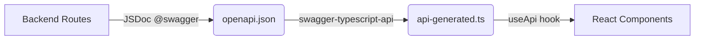

## Overview

PyqDeck uses an **API-first** approach where the backend defines the contract, and the frontend consumes it through a **generated, type-safe SDK**. This eliminates manual `fetch` calls, ensures type safety, and prevents API drift.



## How It Works

### 1. OpenAPI Spec Generation

Backend routes are documented with JSDoc `@swagger` annotations. The `openapi:export` script processes these annotations and outputs `backend/openapi.json`.

```bash
# In backend/
pnpm openapi:export
```

Example route annotation:

```javascript
/**
 * @swagger
 * /papers:
 *   get:
 *     summary: Get all papers
 *     tags: [Papers]
 *     parameters:
 *       - in: query
 *         name: universityId
 *         schema:
 *           type: string
 *     responses:
 *       200:
 *         description: List of papers
 */
router.get('/papers', paperController.getPapers);
```

### 2. SDK Generation

The frontend's `gen:api` script orchestrates the full pipeline:

```json
// frontend/package.json
{
  "scripts": {
    "gen:api": "pnpm --prefix ../backend openapi:export && swagger-typescript-api generate -p ../backend/openapi.json -o ./src/lib -n api-generated.ts --responses --axios"
  }
}
```

This:
1. Runs `openapi:export` in the backend to regenerate the spec
2. Uses `swagger-typescript-api` to generate a TypeScript client
3. Outputs to `frontend/src/lib/api-generated.ts`

**Never manually edit `api-generated.ts`** - it will be overwritten on the next run.

### 3. Using the SDK in React

The generated client is wrapped in a React hook that handles authentication:

```javascript
// frontend/src/hooks/use-api.js
import { useAuth } from '@clerk/nextjs';
import { Api } from '@/lib/api-generated';

export function useApi() {
  const { getToken } = useAuth();

  const api = new Api({
    securityWorker: async () => {
      const token = await getToken();
      return token ? { Authorization: `Bearer ${token}` } : {};
    },
    baseURL: process.env.NEXT_PUBLIC_API_URL,
  });

  return api;
}
```

### 4. Example Usage in Components

```javascript
import { useApi } from '@/hooks/use-api';

export default function PaperList() {
  const api = useApi();
  const [papers, setPapers] = useState([]);

  useEffect(() => {
    api.papers.getPapers().then(({ data }) => setPapers(data));
  }, [api]);

  return papers.map(paper => <PaperCard key={paper.id} paper={paper} />);
}
```

## API Contract Enforcement

The CI pipeline ensures the OpenAPI spec stays in sync:

1. Backend tests run
2. CI verifies `openapi.json` hasn't drifted
3. Frontend build runs `gen:api` to validate SDK generation
4. If any step fails, the PR is blocked

This guarantees:
- Backend changes are always reflected in the API spec
- Frontend always has an up-to-date SDK
- No manual API client bugs or type mismatches

## Available Endpoints

The generated SDK includes all backend endpoints. Here are the main groups:

| Group | Base Path | Description |
|---|---|---|
| Health | `/health` | API health checks |
| Universities | `/universities` | University management |
| Branches | `/branches` | Branch/semester management |
| Subjects | `/subjects` | Subject catalog |
| Papers | `/papers` | Exam papers |
| Questions | `/questions` | Individual questions |
| Solutions | `/solutions` | Question solutions |
| Bookmarks | `/bookmarks` | User bookmarks |
| Search | `/search` | Full-text search |
| Upload | `/uploadthing` | File uploads |

For the complete API reference, see [API Reference Overview](/api-reference/overview).

## Adding New Endpoints

When adding a new backend endpoint:

1. **Add JSDoc annotations** to the route file
2. **Run `openapi:export`** to update the spec
3. **Run `gen:api`** in the frontend to regenerate the SDK
4. **Use the new method** via `useApi()` in your components

The CI will catch any missing annotations or type mismatches.

## Next Steps

- Learn about our [testing standards](/development/testing)
- Explore the [monorepo architecture](/architecture/monorepo)
- Dive into the [auth flow](/architecture/auth-flow)
