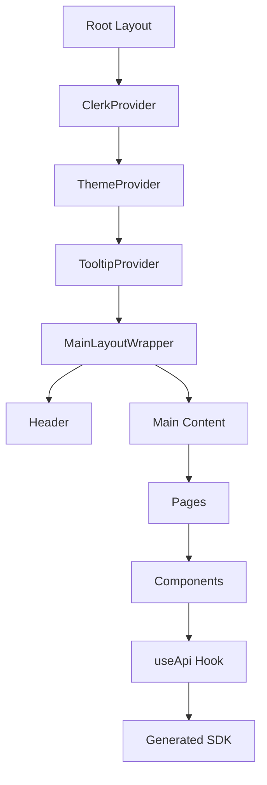

## Overview

The PyqDeck frontend is built with **Next.js 15** and **React 19**, utilizing the **App Router** for a modern, performant, and type-safe development experience.



## Core Technologies

- **Framework**: Next.js 15 (App Router)
- **Styling**: Tailwind CSS 4
- **UI Components**: shadcn/ui (Radix UI)
- **Authentication**: Clerk
- **State Management**: React Context & Hooks
- **API Client**: Axios (via generated SDK)

## Component Hierarchy & Layout Strategy

### Root Layout (`frontend/src/app/layout.jsx`)

The root layout is the entry point for the application. It wraps the entire app with essential providers:

1. **ClerkProvider**: Handles authentication state.
2. **ThemeProvider**: Manages light/dark mode.
3. **TooltipProvider**: Enables tooltips globally.
4. **MainLayoutWrapper**: Handles conditional UI elements.

### MainLayoutWrapper (`frontend/src/components/main-layout-wrapper.jsx`)

We use a wrapper to manage UI elements that shouldn't appear on every page. For example, the global `Header` is hidden when the user is in the **Admin Studio**:

```javascript
export function MainLayoutWrapper({ children }) {
  const pathname = usePathname();
  const isStudio = pathname?.startsWith('/studio');

  return (
    <>
      {!isStudio && <Header />}
      <main className={`flex-1 ${!isStudio ? 'pt-16' : ''}`}>{children}</main>
    </>
  );
}
```

## Authentication (Clerk)

PyqDeck uses **Clerk** for session management and user identity.

- **Initialization**: Managed in `src/components/clerk-provider.jsx`.
- **Route Protection**: Enforced via `src/middleware.js`.
- **Hooks**: We use `useUser()` for profile data and `useAuth()` for session tokens.

## Data Fetching & SDK Integration

We strictly follow an **API-first** approach. The frontend does not write manual `fetch` or `axios` calls. Instead, it consumes a **generated SDK**.

### The `useApi` Hook (`frontend/src/hooks/use-api.js`)

This hook provides an authenticated instance of the API client. It automatically injects the Clerk JWT token into every request:

```javascript
export function useApi() {
  const { getToken } = useAuth();

  const api = useMemo(() => {
    return new Api({
      baseURL: process.env.NEXT_PUBLIC_API_URL,
      securityWorker: async () => {
        const token = await getToken();
        return token ? { headers: { Authorization: `Bearer ${token}` } } : {};
      },
    });
  }, [getToken]);

  return api;
}
```

### Usage Example

```javascript
import { useApi } from '@/hooks/use-api';

export default function SubjectList() {
  const api = useApi();
  const [subjects, setSubjects] = useState([]);

  useEffect(() => {
    api.subjects.getSubjects().then(({ data }) => setSubjects(data.items));
  }, [api]);

  return (
    <ul>
      {subjects.map(s => <li key={s.id}>{s.name}</li>)}
    </ul>
  );
}
```

## Directory Structure

- `src/app/`: Next.js App Router pages and layouts.
- `src/components/ui/`: Low-level, reusable UI primitives (shadcn).
- `src/components/`: Feature-specific components.
- `src/hooks/`: Custom React hooks.
- `src/lib/`: Utilities and the generated SDK (`api-generated.ts`).
- `src/stories/`: Component documentation via Storybook.

## Error Handling

- **Toasts**: We use `sonner` for non-blocking user notifications.
- **Error Boundaries**: Next.js `error.js` files catch and display runtime errors.
- **Monitoring**: Sentry is integrated to track client-side exceptions.
