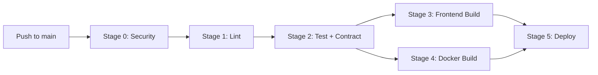

## Overview

PyqDeck uses a **5-stage CI/CD pipeline** on GitHub Actions, defined in `.github/workflows/monorepo-ci.yml`.

## CI/CD Stages

### Stage 0: Security Audit

Runs `pnpm audit --prod` on both `backend` and `frontend` to scan for known vulnerabilities in production dependencies.

### Stage 1: Quality & Linting

Ensures code style consistency using ESLint and Prettier.

### Stage 2: Backend Tests & API Contract

1. **Vitest**: Runs all backend tests using `MongoMemoryServer`.
2. **Coverage**: Checks if coverage meets thresholds (80% for most metrics).
3. **Contract Check**: Runs `pnpm run openapi:export` and verifies that `backend/openapi.json` is in sync with the code.

### Stage 3: Frontend Build & SDK Validation

1. **SDK Generation**: Runs `pnpm run gen:api` in the frontend.
2. **Next.js Build**: Ensures the frontend builds correctly with the generated SDK.

### Stage 4: Docker Build

Builds the backend Docker image (`backend/Dockerfile`) to verify it compiles and packages correctly.

### Stage 5: Deployment

Only triggers on the `main` branch.

- **Backend**: Fires a Render deploy webhook.
- **Frontend**: Handled by Vercel's native GitHub integration.

## Infrastructure Map

- **Backend API**: Render (Docker)
- **Frontend Web**: Vercel
- **Database**: MongoDB Atlas
- **File Storage**: UploadThing
- **Authentication**: Clerk
- **Monitoring**: Sentry (Error Tracking), Better Stack (Logs & Uptime)
