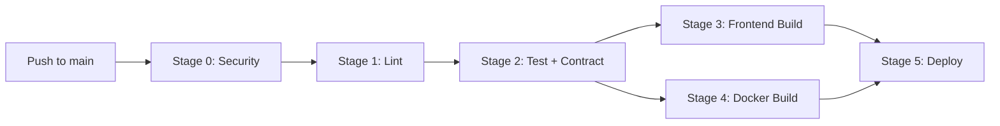

## Overview

PyqDeck uses a **5-stage CI/CD pipeline** on GitHub Actions, with separate deployment targets for the backend (Render), frontend (Vercel), and Storybook (GitHub Pages).



## CI/CD Pipeline Stages

### Stage 0: Security Audit

```yaml
pnpm audit --prod   # Backend
pnpm audit --prod   # Frontend
```

Scans all production dependencies for known vulnerabilities. Fails the pipeline if any critical or high vulnerabilities are found.

### Stage 1: Quality & Linting

```yaml
# Backend
pnpm install
pnpm run lint           # ESLint
pnpm run format:check   # Prettier

# Frontend
pnpm install
pnpm run lint           # ESLint
pnpm run format:check   # Prettier
```

Ensures code style consistency. All PRs must pass linting and formatting checks.

### Stage 2: Backend Tests & API Contract

```yaml
# Install MongoDB binary for test environment
# Run tests with coverage
pnpm run test:coverage

# Verify OpenAPI spec hasn't drifted
pnpm run openapi:export
git diff --exit-code backend/openapi.json
```

This is the most critical stage:

1. **Vitest** runs all backend tests with an in-memory MongoDB (MongoMemoryServer)
2. **Coverage** is uploaded to Codecov — minimum thresholds: 80% lines/functions/statements, 70% branches
3. **Contract Check** verifies that `openapi.json` is in sync with the route code. If a developer changes an API route without updating the JSDoc annotations (or vice versa), the build fails

### Stage 3: Frontend Build & SDK Validation

```yaml
pnpm install    # Both packages
pnpm run gen:api   # Regenerate SDK from openapi.json
pnpm run build     # Next.js build
```

This stage validates that:
- The SDK generates successfully from the current OpenAPI spec
- The frontend builds without errors using the generated SDK
- TypeScript types are all satisfied

If a backend change breaks the frontend types, this stage catches it.

### Stage 4: Docker Build

```yaml
docker build -t pyqdeck-backend ./backend
```

Builds the backend Docker image to verify it compiles and packages correctly. The image is **not pushed** — this is a validation step only.

### Stage 5: Deployment

Only triggers on `push` to `main` (not on PRs), after all previous stages pass.

**Backend (Render)**:

```bash
curl -X POST $RENDER_DEPLOY_HOOK
```

Fires a Render deploy webhook. Render pulls the latest code, builds the Docker image, and deploys to production.

**Frontend (Vercel)**:

Vercel's native GitHub integration handles this separately — it detects changes to the `frontend/` directory and deploys automatically.

## Deployment Targets

| Service | Platform | Method | URL |
|---|---|---|---|
| Backend API | Render | Docker (webhook) | backend.pyqdeck.in |
| Frontend Web | Vercel | GitHub integration | pyqdeck.in |
| Storybook | GitHub Pages | GitHub Actions | storybook.pyqdeck.in |
| API Docs | Swagger UI | Served by backend | backend.pyqdeck.in/api-docs |
| Engineering Docs | Mintlify | GitHub integration | pyqdeck.mintlify.app |
| Status Page | BetterUptime | External monitoring | pyqdeck.betteruptime.com |

## Render Configuration

**File**: `render.yaml`

```yaml
services:
  - name: pyqdeck-backend
    type: web
    runtime: docker
    plan: free
    region: singapore
    healthCheckPath: /api/v1/health
    envVars:
      - key: NODE_ENV
        value: production
      - key: PORT
        value: 3000
      # Sensitive vars set in Render dashboard:
      # MONGODB_URI, CLERK keys, RESEND_API_KEY, etc.
```

Docker context is set to `./backend`, so Render builds from the backend directory.

## Docker Configuration

**File**: `backend/Dockerfile`

Multi-stage build for minimal image size:

| Stage | Purpose |
|---|---|
| `deps` | Install production dependencies only (`pnpm install --prod --frozen-lockfile`) |
| `runner` | Copy `node_modules`, `package.json`, and `src/` |

Security measures:
- **Non-root user** (`nodeuser`, UID 1001)
- **No dev dependencies** in the final image
- **Slim base image** (`node:20-slim`)

```dockerfile
EXPOSE 3000
CMD ["node", "src/index.js"]
```

## GitHub Actions Workflows

Beyond the main pipeline, there are 7 additional workflows:

| Workflow | Trigger | Purpose |
|---|---|---|
| **Lighthouse CI** | PR on `frontend/**` | Performance audit — ensures Lighthouse scores stay above 90 |
| **Bundle Analysis** | PR on `frontend/**` | Tracks Next.js bundle size changes with PR comments |
| **CodeQL** | Push/PR to main + weekly cron | Static security analysis for JavaScript |
| **Load Test** | Push/PR on `backend/**` | k6 smoke test against a live API with MongoDB service container |
| **PR Size Labeler** | PR opened/synced | Auto-labels PRs by changed lines (XS/S/M/L) |
| **Storybook Deploy** | Push to main on `frontend/**` | Builds and deploys Storybook to GitHub Pages |
| **Release Drafter** | Push to main | Drafts release notes from merged PRs |

All workflows use `cancel-in-progress: true` to avoid redundant builds on the same branch.

## Environment Variables

### Backend (Render)

| Variable | Purpose |
|---|---|
| `NODE_ENV` | `production` |
| `PORT` | `3000` |
| `MONGODB_URI` | MongoDB connection string |
| `CLERK_PUBLISHABLE_KEY` | Clerk auth public key |
| `CLERK_SECRET_KEY` | Clerk auth secret key |
| `CLERK_WEBHOOK_SECRET` | Svix webhook secret |
| `RESEND_API_KEY` | Resend email API key |
| `MAIL_FROM` | Sender email address |
| `SENTRY_DSN` | Sentry error tracking DSN |
| `LOGTAIL_SOURCE_TOKEN` | Better Stack logging token |
| `UPLOADTHING_TOKEN` | UploadThing file storage token |
| `RATE_LIMIT_WINDOW_MS` | Rate limit window (default: 900000) |
| `RATE_LIMIT_MAX` | Max requests per window (default: 100) |

### Frontend (Vercel)

| Variable | Purpose |
|---|---|
| `NEXT_PUBLIC_CLERK_PUBLISHABLE_KEY` | Clerk public key |
| `NEXT_PUBLIC_API_URL` | Backend API URL (defaults to production) |

## Concurrency Strategy

All workflows are configured with path filtering so that:
- Changes to `backend/**` only trigger backend workflows
- Changes to `frontend/**` only trigger frontend workflows
- Changes to `docs/**` only trigger docs deployment
- Full monorepo CI runs on any change

This keeps CI fast and efficient.

## Next Steps

- Learn about [monitoring and observability](/infrastructure/monitoring)
- Review the [CI/CD pipeline](/infrastructure/deployment)
- Explore the [monorepo architecture](/architecture/monorepo)
