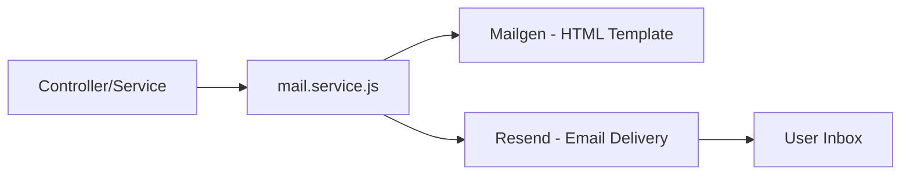

## Overview

PyqDeck uses **Resend** for email delivery and **Mailgen** for HTML email template generation. The system is implemented but not yet wired into the application's routes/controllers.



## Configuration

### Environment Variables

| Variable | Example | Purpose |
|---|---|---|
| `RESEND_API_KEY` | `re_abc123...` | Resend API authentication key |
| `MAIL_FROM` | `onboarding@resend.dev` | Sender "from" address |
| `APP_NAME` | `PyqDeck` | Product name displayed in email templates |
| `APP_URL` | `https://pyqdeck.in` | Product link in email footer |

### Setup (`backend/src/config/mail.config.js`)

```javascript
import Resend from 'resend';
import Mailgen from 'mailgen';
import config from './index.js';

let resendClient = null;
let mailGenerator = null;

if (config.mail.apiKey) {
  resendClient = new Resend(config.mail.apiKey);
}

mailGenerator = new Mailgen({
  theme: 'default',
  product: {
    name: config.mail.appName,
    link: process.env.APP_URL || 'http://localhost:3000',
  },
});
```

**Key design decision**: If no `RESEND_API_KEY` is set, `resendClient` is `null` and all email functions become no-ops. This allows the app to run locally without email configuration.

## Email Types

Three email functions are available in `backend/src/services/mail.service.js`:

### 1. Verification Email (OTP)

```javascript
sendVerificationEmail(email, otp)
```

| Property | Value |
|---|---|
| Subject | `"Verify Your Email"` |
| Content | "Use the following OTP to verify your email:" |
| Button color | Green (`#22BC66`) |
| Display | OTP code as button text |

### 2. Welcome Email

```javascript
sendWelcomeEmail(email, name)
```

| Property | Value |
|---|---|
| Subject | `"Welcome to Our Platform"` |
| Content | `"Welcome ${name}! We're glad to have you on board."` |
| Outro | "Feel free to reach out if you have any questions." |
| CTA | Link to the app via `APP_URL` |

### 3. Password Reset Email (OTP)

```javascript
sendPasswordResetEmail(email, otp)
```

| Property | Value |
|---|---|
| Subject | `"Reset Your Password"` |
| Content | "Use the following OTP to reset your password:" |
| Button color | Red (`#FF0000`) |
| Display | OTP code as button text |

## How Templates Work

There are **no static HTML template files**. All email templates are generated dynamically via Mailgen's API at runtime.

### OTP Emails (Action-based)

```javascript
const emailContent = mailGenerator.generate({
  body: {
    action: {
      instructions: 'Use the following OTP to verify your email:',
      button: {
        color: '#22BC66',
        text: otp,
      },
    },
  },
});
```

Mailgen renders this into a responsive HTML email with the OTP displayed as a prominent action button.

### Welcome Email (Text-based)

```javascript
const emailContent = mailGenerator.generate({
  body: {
    intro: `Welcome ${name}! We're glad to have you on board.`,
    outro: 'Feel free to reach out if you have any questions.',
  },
});
```

### Sending the Email

```javascript
await resendClient.emails.send({
  from: config.mail.from,
  to: email,
  subject: 'Verify Your Email',
  html: emailContent.html,
  text: emailContent.plaintext,
});
```

Each email is sent with both HTML and plain text versions for maximum compatibility.

## Error Handling

All three functions follow the same pattern:

```javascript
export async function sendVerificationEmail(email, otp) {
  if (!resendClient) return;  // Graceful no-op

  try {
    // Generate template + send
    const emailContent = mailGenerator.generate({ ... });
    await resendClient.emails.send({ ... });
    loggerService.info(`Verification email sent to ${email}`);
  } catch (error) {
    loggerService.error(`Failed to send verification email: ${error.message}`);
    throw error;  // Don't swallow - caller should handle
  }
}
```

- **No API key** → returns immediately (no error)
- **Send fails** → logs error + throws (caller must handle)
- **Success** → logs confirmation

## Current Status: Not Yet Wired In

**The email service functions are implemented but not called anywhere in the application.** No controller, route, or service imports from `mail.service.js`.

### Where They Should Be Connected

| Email Type | Suggested Trigger Point |
|---|---|
| Verification OTP | After user signs up, before Clerk confirms email |
| Welcome Email | After `user.created` Clerk webhook event |
| Password Reset OTP | When user requests password reset |

### Example: Wiring into Clerk Webhook

```javascript
// backend/src/routes/webhook.js
import { sendWelcomeEmail } from '../services/mail.service.js';

router.post('/webhooks/clerk', async (req, res) => {
  const event = verifyWebhook(req);

  if (event.type === 'user.created') {
    const { email_addresses, first_name } = event.data;
    const primaryEmail = email_addresses[0]?.email_address;

    if (primaryEmail) {
      await sendWelcomeEmail(primaryEmail, first_name || 'there');
    }
  }

  res.json({ received: true });
});
```

## Resend Setup

### Getting an API Key

1. Sign up at [resend.com](https://resend.com)
2. Create an API key from the dashboard
3. Free tier: 3,000 emails/month, 100 emails/day

### Domain Verification

For production, verify your domain in Resend to:
- Remove the "via resend.net" footer
- Use your own `from` address (e.g., `noreply@pyqdeck.in`)
- Improve email deliverability

Add the provided DNS records (SPF, DKIM, DMARC) to your domain registrar.

### Testing Locally

Resend provides a test mode where emails are logged but not actually sent. Use the test API key (`re_123456789`) for local development.

## Testing

The email service has full test coverage:

### Happy Path Tests

```javascript
// tests/services/mail.service.test.js
it('should send verification email successfully', async () => {
  mockResend.emails.send.mockResolvedValue({ id: 'test-id' });
  await sendVerificationEmail('user@test.com', '123456');
  expect(mockResend.emails.send).toHaveBeenCalled();
});
```

### Error Path Tests

```javascript
it('should throw error when sending fails', async () => {
  mockResend.emails.send.mockRejectedValue(new Error('API error'));
  await expect(sendVerificationEmail('user@test.com', '123456'))
    .rejects.toThrow('API error');
});
```

### No-Config Tests

```javascript
// tests/services/mail.no-config.test.js
it('should return early when resendClient is null', async () => {
  const result = await sendVerificationEmail('user@test.com', '123456');
  expect(result).toBeUndefined();  // No-op
});
```

## Future Enhancements

When wiring the email system into the app, consider:

1. **Email queue** — Use a queue (Bull, Redis) to handle email sending asynchronously
2. **Email templates** — Create custom Mailgen themes or switch to a more flexible template engine for complex emails
3. **Email analytics** — Track open rates, click rates via Resend's analytics API
4. **Additional email types** — Notification emails, study reminders, paper update alerts
5. **OTP storage** — Store OTPs with expiry in Redis or MongoDB for verification

## Next Steps

- Explore the [auth flow](/workflows/auth-flow)
- Review the [data pipeline](/workflows/data-pipeline)
- Check [monitoring setup](/infrastructure/monitoring)
