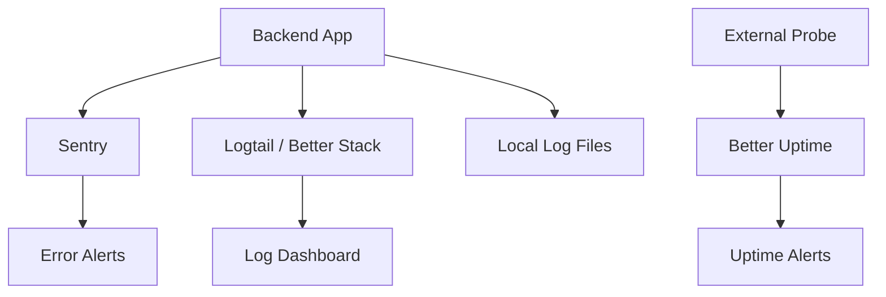

## Overview

PyqDeck uses a three-layer observability stack: **Sentry** for error tracking and profiling, **Better Stack (Logtail)** for structured logging, and **Better Uptime** for availability monitoring.



## Error Tracking: Sentry

**Packages**: `@sentry/node` v10, `@sentry/profiling-node` v10

### Initialization

Sentry is initialized in the backend entry point (`backend/src/index.js`):

```javascript
import * as Sentry from '@sentry/node';
import { nodeProfilingIntegration } from '@sentry/profiling-node';

if (process.env.SENTRY_DSN) {
  Sentry.init({
    dsn: process.env.SENTRY_DSN,
    environment: config.nodeEnv,
    integrations: [nodeProfilingIntegration()],
    tracesSampleRate: 1.0,    // 100% of transactions
    profilesSampleRate: 1.0,  // Profiling for all traces
  });
}
```

### What's Captured

| Feature | Setting | Impact |
|---|---|---|
| Error tracking | All 500+ errors | Captured via `Sentry.captureException(err)` |
| Performance traces | `tracesSampleRate: 1.0` | 100% of requests traced |
| CPU profiling | `profilesSampleRate: 1.0` | CPU profiles attached to traces |
| Environment tagging | `environment: config.nodeEnv` | Separates dev/staging/production |

### Error Handler Middleware

All server errors flow through the error handler (`backend/src/middlewares/errorHandler.js`):

```javascript
import * as Sentry from '@sentry/node';

export const errorHandler = (err, req, res, next) => {
  // Report to Sentry
  if (err.statusCode >= 500) {
    Sentry.captureException(err);
  }

  // Log locally
  logger.error(err.message, {
    stack: err.stack,
    path: req.path,
    method: req.method,
  });

  // Send response (strip stack in production)
  res.status(err.statusCode || 500).json({
    success: false,
    error: {
      message: config.nodeEnv === 'production' && err.statusCode >= 500
        ? 'Internal server error'
        : err.message,
    },
  });
};
```

Sentry also sets up Express error handling via `Sentry.setupExpressErrorHandler(app)` in `app.js`.

## Logging: Winston + Better Stack

**Packages**: `winston`, `@logtail/node`, `@logtail/winston`

### Three Transport Layers

The logger (`backend/src/utils/logger/index.js`) sends logs to three destinations:

| Transport | Format | Retention | Purpose |
|---|---|---|---|
| **Console** | Colorized, timestamped (`YYYY-MM-DD HH:mm:ss`) | N/A | Local development |
| **Daily Rotating File** | JSON, `logs/application-YYYY-MM-DD.log` | 14 days, 20MB max per file | Local archive |
| **Logtail (Better Stack)** | JSON, structured | Configurable in Better Stack | Production monitoring |

### Logtail Configuration

Logtail is enabled when `LOGTAIL_SOURCE_TOKEN` is set:

```javascript
import { Logtail } from '@logtail/node';
import { LogtailTransport } from '@logtail/winston';

if (process.env.LOGTAIL_SOURCE_TOKEN) {
  const logtail = new Logtail(process.env.LOGTAIL_SOURCE_TOKEN);
  transports.push(new LogtailTransport(logtail));
}
```

On startup, the system logs: `"System initialized and connected to Better Stack!"`

### HTTP Request Logging

Morgan middleware logs all HTTP requests in `'dev'` format:

```
GET /api/v1/papers 200 45.2ms
POST /api/v1/bookmarks 201 12.8ms
```

## Availability Monitoring: Better Uptime

**URL**: [pyqdeck.betteruptime.com](https://pyqdeck.betteruptime.com/)

Better Uptime monitors the health endpoint:

```
GET /api/v1/health
```

If the endpoint is unreachable or returns a non-200 status, Better Uptime sends alerts to the team.

## Rate Limiting

**File**: `backend/src/middlewares/rateLimiter.middleware.js`

- **Store**: In-memory TTL (not Redis)
- **Default**: 100 requests per 15-minute window
- **Configurable** via `RATE_LIMIT_WINDOW_MS` and `RATE_LIMIT_MAX` env vars

Rate limit exceeded responses include standard headers:

```http
X-RateLimit-Limit: 100
X-RateLimit-Remaining: 0
X-RateLimit-Reset: 1620000000
```

## Health Endpoints

| Endpoint | Description |
|---|---|
| `/api/v1/health` | Simple health check (used by Better Uptime and Render) |
| `/api/v1/health/detailed` | Detailed health including database connection status |

## Debugging Production Issues

### Step 1: Check Better Uptime

If the service is down, Better Uptime will show the outage and when it started.

### Step 2: Check Sentry

For application errors:
1. Open the Sentry dashboard
2. Filter by environment (`production`)
3. Check the error's transaction trace for the full request lifecycle
4. View the attached CPU profile to identify performance bottlenecks

### Step 3: Check Better Stack

For structured log analysis:
1. Open the Better Stack dashboard
2. Search logs by user ID, request path, or error message
3. Correlate with Sentry events using timestamps

### Step 4: Check Render Logs

For deployment and infrastructure issues:
1. Open the Render dashboard
2. View the service logs for startup errors, crash loops, or deployment failures

## Security Considerations

- **Stack traces are stripped** in production for 500-level errors
- **`CLERK_SECRET_KEY`** is never logged or exposed
- **Rate limiting** prevents abuse
- **Non-root Docker user** limits container escape risk

## Next Steps

- Review the [deployment pipeline](/infrastructure/deployment)
- Explore the [monorepo architecture](/system-overview/architecture)
- Learn about [testing standards](/system-overview/testing)
