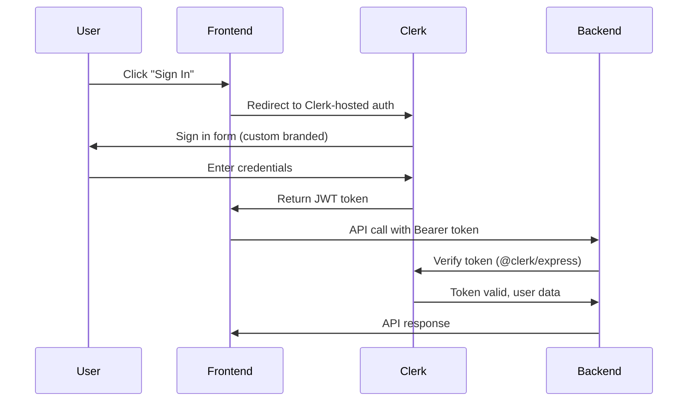

## Overview

PyqDeck uses **Clerk** for authentication, with custom branding on the frontend and Svix webhooks for user synchronization on the backend.



## Frontend Auth

### Clerk Provider

The app is wrapped with `ClerkProvider` in the root layout (`frontend/src/app/layout.jsx`):

```javascript
import { ClerkProvider } from '@/components/clerk-provider';

export default function RootLayout({ children }) {
  return (
    <ClerkProvider>
      {children}
    </ClerkProvider>
  );
}
```

### Auth Pages

Custom sign-in and sign-up pages using Clerk's components:

- **Sign In**: `frontend/src/app/sign-in/[[...sign-in]]/page.jsx`
- **Sign Up**: `frontend/src/app/sign-up/[[...sign-up]]/page.jsx`

### Getting the Token for API Calls

The `useApi()` hook handles token injection automatically using Clerk's `getToken()` method.

## Backend Auth

### Middleware Verification

The backend uses `@clerk/express` to verify JWT tokens on protected routes.

- **Middleware**: `backend/src/middlewares/auth.middleware.js`
- **Logic**: The `requireAuthentication` middleware checks for a valid `userId` in the request.

```javascript
// backend/src/middlewares/auth.middleware.js
export function requireAuthentication(req, res, next) {
  const { userId } = getAuth(req);
  if (!userId) {
    return next(new UnauthorizedError('Authentication required'));
  }
  next();
}
```

### Authorization (Roles)

Roles are managed in MongoDB and attached to the request via the `syncUser` middleware.

- **Admin Only**: `isAdmin` middleware
- **Editor or Admin**: `isEditor` middleware

## Webhook Synchronization

Clerk sends webhooks for user events (creation, updates, deletion). The backend processes these via **Svix** for security.

- **Route**: `backend/src/routes/webhook.js`
- **Controller**: `backend/src/controllers/webhookController.js`
- **Service**: `backend/src/services/userService.js`

### Webhook Flow

1. **Verification**: `webhookController.js` uses `svix` to verify the webhook signature.
2. **Dispatch**: Based on the event type (`user.created`, `user.updated`, `user.deleted`), it calls the corresponding method in `userService.js`.
3. **Database Sync**: `userService.js` interacts with `userRepository.js` to update the MongoDB user record.

### User Sync Middleware (`backend/src/middlewares/syncUser.middleware.js`)

To handle cases where a user might exist in Clerk but not yet in our MongoDB (or to ensure roles are up-to-date), the `syncUser` middleware runs on every authenticated request. It lazily creates or updates the user record in our database.

## Security Considerations

1. **Signature Verification**: All webhooks must be verified using the `CLERK_WEBHOOK_SECRET`.
2. **Role Enforcement**: Critical routes are protected by role-based middleware (`isAdmin`, `isEditor`).
3. **NoSQL Injection**: User-provided data from webhooks is sanitized before being saved to MongoDB.
