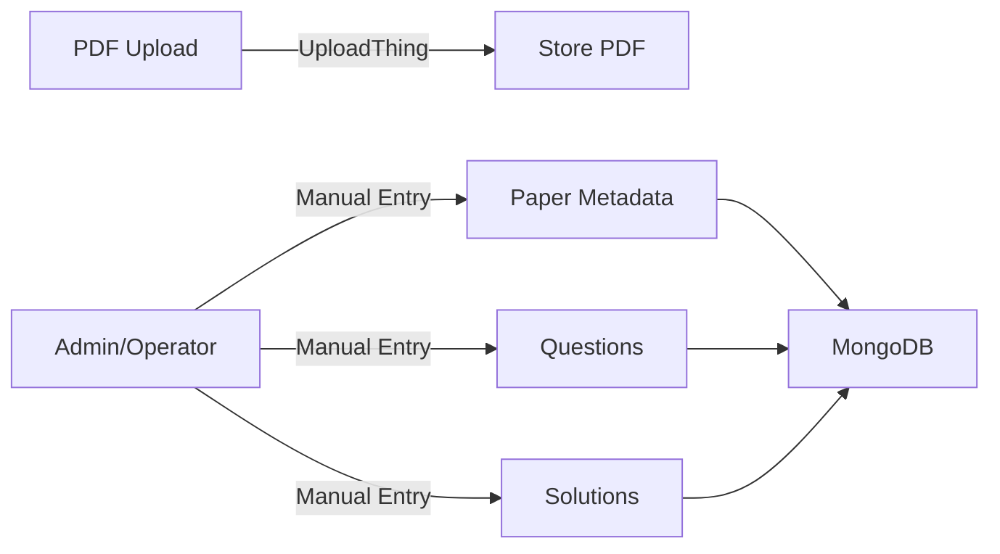

## Overview

PyqDeck's core value is its collection of university question papers. This page explains how papers flow into the system and how questions and solutions are managed.

## Implementation Map

| Step               | Implementation Path                             | Key Files                            |
| ------------------ | ----------------------------------------------- | ------------------------------------ |
| **PDF Upload**     | `backend/src/utils/uploadthing.js`              | `Upload.js` (Model)                  |
| **Paper Creation** | `backend/src/controllers/paperController.js`    | `Paper.js` (Model)                   |
| **Question Entry** | `backend/src/controllers/questionController.js` | `Question.js`, `QuestionPaperMap.js` |
| **Solutions**      | `backend/src/controllers/solutionController.js` | `Solution.js` (Model)                |

## 1. Upload Pipeline (`backend/src/utils/uploadthing.js`)

Users upload question paper PDFs through **UploadThing**.

- **File**: `backend/src/utils/uploadthing.js`
- **Model**: `backend/src/models/Upload.js`

When an upload completes, the backend receives a callback and stores the metadata in the `Upload` collection.

## 2. Paper Management (`backend/src/controllers/paperController.js`)

Paper metadata (title, year, etc.) is managed via the `paperController`.

- **Service**: `backend/src/services/paperService.js`
- **Repository**: `backend/src/repositories/paperRepository.js`
- **Model**: `backend/src/models/Paper.js`

Papers go through a status workflow: `draft → pending → approved`. Public users can only see `approved` papers.

## 3. Question & Syllabus Mapping

Questions are linked to papers via a join table pattern.

- **Model**: `backend/src/models/Question.js`
- **Mapping**: `backend/src/models/QuestionPaperMap.js` (links Question to Paper)
- **Syllabus**: `backend/src/models/QuestionSyllabusMap.js` (links Question to Syllabus Topic)

This allows for polymorphic questions that can belong to multiple papers or topics.

## 4. Solutions

Solutions are stored separately and linked to questions.

- **Model**: `backend/src/models/Solution.js`
- **Types**: `teacher`, `student`, `ai`

## Academic Hierarchy

The system follows a strict hierarchy defined in the `models/` directory:

1. **University** (`University.js`)
2. **Branch** (`Branch.js`)
3. **Semester** (`Semester.js`)
4. **Subject** (`Subject.js`)
5. **SubjectOffering** (`SubjectOffering.js`) - The link between a subject and a specific semester.
6. **Paper** (`Paper.js`)

## Future: AI-Powered Parsing

The architecture is designed to support automated PDF parsing. The `Solution.type: 'ai'` enum is already reserved for AI-generated answers, and the `Question` model includes fields for normalized text to aid in AI extraction.
