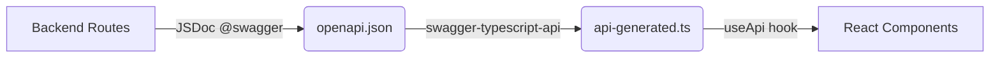

## Overview

PyqDeck uses an **API-first** approach where the backend defines the contract, and the frontend consumes it through a **generated, type-safe SDK**. This eliminates manual `fetch` calls, ensures type safety, and prevents API drift.



## How It Works

### 1. OpenAPI Spec Generation

Backend routes are documented with JSDoc `@swagger` annotations. The `openapi:export` script processes these annotations and outputs `backend/openapi.json`.

```bash
# In backend/
pnpm openapi:export
```

Example route annotation (`backend/src/routes/papers.js`):

```javascript
/**
 * @swagger
 * /papers:
 *   get:
 *     summary: Get all papers
 *     tags: [Papers]
 *     parameters:
 *       - in: query
 *         name: universityId
 *         schema:
 *           type: string
 *     responses:
 *       200:
 *         description: List of papers
 */
router.get("/papers", paperController.getPapers);
```

### 2. SDK Generation

The frontend's `gen:api` script orchestrates the full pipeline:

```json
// frontend/package.json
{
  "scripts": {
    "gen:api": "pnpm --prefix ../backend openapi:export && swagger-typescript-api generate -p ../backend/openapi.json -o ./src/lib -n api-generated.ts --responses --axios"
  }
}
```

This:

1. Runs `openapi:export` in the backend to regenerate the spec.
2. Uses `swagger-typescript-api` to generate a TypeScript client.
3. Outputs to `frontend/src/lib/api-generated.ts`.

**Never manually edit `api-generated.ts`** - it will be overwritten on the next run.

### 3. Using the SDK in React

The generated client is wrapped in a React hook that handles authentication:

```javascript
// frontend/src/hooks/use-api.js
import { useAuth } from "@clerk/nextjs";
import { Api } from "@/lib/api-generated";

export function useApi() {
  const { getToken } = useAuth();

  const api = useMemo(() => {
    return new Api({
      securityWorker: async () => {
        const token = await getToken();
        return token ? { headers: { Authorization: `Bearer ${token}` } } : {};
      },
      baseURL: process.env.NEXT_PUBLIC_API_URL,
    });
  }, [getToken]);

  return api;
}
```

## API Contract Enforcement

The CI pipeline ensures the OpenAPI spec stays in sync:

1. **Backend Tests**: Verify logic.
2. **Contract Check**: Verify `openapi.json` hasn't drifted from the code.
3. **Frontend Build**: Runs `gen:api` to validate SDK generation and TypeScript types.

This guarantees that backend changes never break the frontend silently.

## Next Steps

- [API Reference Overview](/api-reference/overview)
- [Frontend Architecture](/frontend/architecture)
- [Backend Architecture](/backend/architecture)
